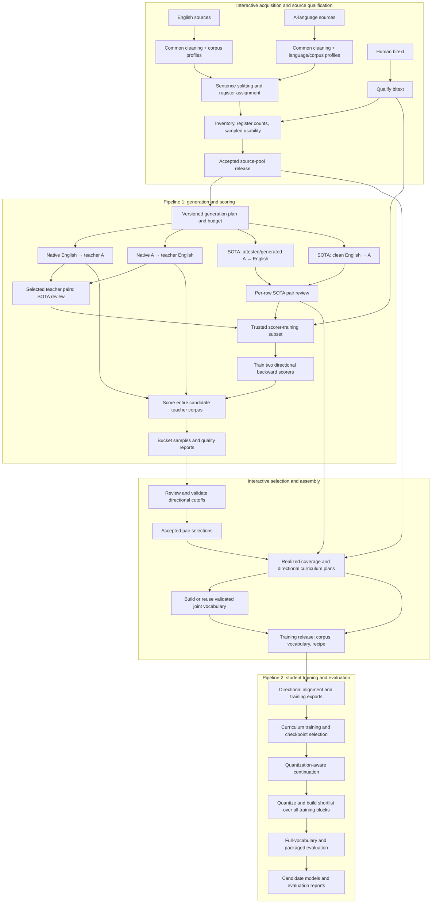

# Training pipeline implementation plan

This plan consolidates the agreed architecture for language-pair training.
`PIPELINE.md` describes the training approach; this document describes its data,
execution and review boundaries. `A` denotes the non-English language.

## Objectives and constraints

- Run the orchestration engine locally or self-hosted; no required cloud control
  plane. Remote compute may run on Vast through the existing execution layer.
- Make the DAG, artifacts, provenance, pending decisions and results inspectable.
- Keep execution programmatic. Introduce human or LLM judgment at explicit data
  review boundaries, rather than requiring an agent to babysit remote commands.
- Reuse acquired corpora and completed translations across languages, directions
  and experiments. Do not regenerate data just to change a sampling schedule.
- Preserve provenance for every dataset and row through cleaning, translation,
  deduplication, filtering, reversal and training selection.
- Concentrate expensive supervision on bounded SOTA generation, scorer-training
  examples and representative reviews. Do not require frontier judging of every
  source and every pair in a multi-million-row KD corpus.
- Support broad everyday translation: prose, dialogue, informal text, UI, labels,
  short inputs and varied vocabulary. FLORES alone is insufficient.

Implementation of this plan does not itself authorize rentals, deployment or
publication to external services.

## Architecture: two pipelines and two review boundaries

Interactive work publishes immutable releases. Automated pipelines consume those
releases and publish their own artifacts. Reviews may happen through scripts,
notebooks or another interface; the engine does not require an embedded chat or
approval UI to execute the initial implementation.



If review finds a coverage shortage, publish another bounded generation plan and
run an additional tranche. Preserve prior artifacts. Revisions are ordinary
iterations, not reasons to restart acquisition or completed translation jobs.

## Boundary 1: acquire, clean and qualify sources

Maintain a shared cleaning framework composed with explicit language and corpus
profiles. Reuse established rules for subtitle music notes, applause/stage tags,
formatting noise, wrong scripts and other mechanical defects. Add specific rules
for contamination such as Kazakh/Töte in Uyghur sources or Slavic text encoded
with Georgian codepoints. Prefer composed rules over an inheritance hierarchy.

Each rule has versioned implementation, known-clean and defective test examples,
and reports of affected rows by source and register. Preserve originals and
transformation ancestry. Mechanical cleanliness does not establish naturalness
or semantic usability.

Sentence splitting belongs in these profiles and runs before source selection
and generation. Use behavior consistent with the translation runtime, including
caseless scripts, abbreviations and subtitle punctuation. Test representative
multi-sentence inputs for each language. Preserve parent row identity and child
sentence position. Do not independently split the two sides of existing bitext:
retain verified sentence correspondence or explicitly realign the segments.

Register is a content assignment separate from corpus provenance. OPUS corpus
labels can provide useful defaults, but HPLT or Wikipedia origin alone cannot
supply the register counts used for assembly. Implement a versioned mono-text
assignment stage using length/shape heuristics for observable classes and a
classifier where prose, dialogue, UI or labels require content judgment.
Length alone must not turn short prose or named entities into labels.

Calibrate assignments against reviewed samples per language and source. Store
the assigned register, method/version and confidence or an explicit unassigned
state. Report unassigned coverage instead of inventing precision. Keep length,
script mixture and entity indicators as separate features so register and shape
remain inspectable. Publish assignments separately from source text; improving
the classifier changes assembly eligibility without retranslating unchanged
rows whose teacher outputs already exist.

Use `judge_mono.py`-style uniform source samples to choose the most usable sources
when there is sufficient supply. Review intelligibility, degraded machine text,
register and coverage. Use these judgments to accept or reject whole sources;
do not train or apply a row-level source-quality classifier in the initial
implementation. Mechanical cleaning remains row-level. Record remaining
uncertainty within accepted sources. Before translations exist, source
usability can be assessed; translation faithfulness cannot. Pair review of
existing bitext is a separate assessment.

Publish an accepted source-pool release with:

- Immutable references to cleaned English, cleaned A and accepted bitext.
- Source snapshots, licences and original-record provenance.
- Cleaning/profile versions and reports.
- Sentence-splitter and register-assignment versions and reviewed calibration.
- Register and length distributions, deduplicated counts and quality samples.
- Development/evaluation exclusions and their versions.

English cleaning is independent of any target language. Each pair pins the same
reusable English pool when appropriate and derives its own register selection.
Abundant English still requires cleaning and representative sampling.

## Pipeline 1: generation and scoring

### Generation is shared across directions

There are two bulk teacher-generation jobs:

| Generated pair | A→en student role | en→A student role |
|---|---|---|
| Native A + teacher English | KD | BT |
| Native English + teacher A | BT | KD |

Translate each selected source once and retain its provenance. Reversing its role
does not require another generation job or another physical copy of the text.
Filtering, alignment and sampling decisions remain directional.

Generate SOTA data in parallel in bounded tranches. Prefer attested A translated
into English where available, and preselected clean English translated into A.
Generate both sides where needed to fill coverage gaps, keeping that origin
distinct from attested sources. Judge every generated SOTA pair for faithfulness
and usability; sample-review judge behavior because acceptance is fallible.

The available generation budget is approximately 100k–200k candidate samples per
day, before judging and deduplication costs. Treat this as a planning constraint
to measure, not a guaranteed accepted yield. Choose initial quantities from the
inventory; determine additional needs after observing accepted coverage.

### Backward scorers

The filter's intended job is the gross-failure tail: fabrication and unwanted
copy-through. Nuanced meaning and register judgments stay with review. Trusted
training volume and coverage are the initial constraints; a shallow RNN trained
on a few hundred thousand pairs should not be expected to make fine semantic
distinctions. Keep the existing architecture initially and measure whether its
buckets separate these coarse failures before considering architectural changes.

Train one scorer in each direction. For an A→en student, score the probability of
the original A source conditioned on the English translation; reverse that for
the en→A student.

Use a mixture of reviewed SOTA-generated pairs and independently SOTA-judged
KD/BT pairs, supplemented by accepted human bitext. Including accepted teacher
pairs exposes scorers to valid translations beyond the SOTA generator's style.
Judging must assess meaning and usability rather than preferred wording.

Do not train scorers indiscriminately on the candidate corpus they will filter.
Record the exact scorer-training membership. Those pairs can also train the
final student, but their scorer scores are not independent quality evidence.
Exclude them from cutoff calibration and filtering-accuracy estimates.

Run both cheap scorers across the entire candidate KD/BT corpus. Previously
reviewed scorer-training pairs may be retained on their review evidence even if
they fail the numerical cutoff. Preserve that acceptance reason explicitly.
Reviewed human and SOTA blocks bypass automatic backward rejection by default.

Even gross fabrication or copying may score well, so the intended job is not a
guarantee of detection. Using a reverse teacher to score its own generated BT is
especially correlated and must not be treated as independent judgment.

### Dual scores: compute once, explore selection with DuckDB

For every candidate pair, retain both directional cross-entropies:

- `h_en_given_a`: English conditioned on A.
- `h_a_given_en`: A conditioned on English.

These names describe language direction, not the pair's KD/BT role. Both students
reuse the same scores. Store them as independent measurements keyed by pair ID
and scorer revision; expose a DuckDB view joining the two columns for analysis.
Record tokenizer and normalization revisions, scored token counts and membership
in each scorer's training set. Missing or failed scores are explicit states and
must never be treated as zero cross-entropy.

Retain the components rather than only a combined score. Explore backward-only,
forward-only and dual scoring against the same reviewed samples. The published
dual conditional cross-entropy criterion, with lower scores preferred, is:

```text
abs(h_en_given_a - h_a_given_en)
    + 0.5 * (h_en_given_a + h_a_given_en)
```

Reference: [Dual conditional cross-entropy filtering][dual-scoring].

[dual-scoring]: https://aclanthology.org/W18-6478/

Treat this formula as a baseline to calibrate, not a mandatory selection rule.
DuckDB can compute alternative directional weights, disagreement penalties and
cutoffs directly from the stored columns. A weak scorer must not dominate by
accident; assess directional scale and performance on reviewed data. Choose
policies by bad pairs removed versus good pairs lost, with nuance left to review.

Changing weights, cutoffs or register-specific policies reruns only queries and
selection publication, never generation or scorer inference. Compute scores once
per pair and scorer configuration; score only new pairs for an added tranche.
Changing a scorer, tokenizer, normalization or pair text requires new applicable
scores. Keep old score revisions so previous selections remain reproducible.

During exploration, query counts, register balance and review samples without
writing another corpus. Once accepted, freeze the selected pair IDs and publish
the policy expression/parameters with its exact input and score revisions.
Record reviewed acceptance exceptions separately from numerical acceptance.
Policy changes affect downstream training releases, not immutable text or scores.

## Boundary 2: calibrate selection and publish training data

Review uniform samples to estimate overall usability, then samples across score
buckets to evaluate potential cutoffs. Inspect both proposed keep and reject
regions, including the useful material a cutoff would discard.

Calibrate per student direction, KD/BT role, data source, register and length
where evidence supports different behavior. Avoid separate thresholds for tiny
strata without enough reviewed examples. Record whether higher or lower scores
are better, score normalization and scorer revision. There is no universal
numeric cutoff such as 20 across languages or models.

Register stratification checks for scorer bias and supports coarse rejection
where measured; it does not grant the scorer authority over nuanced differences
within each register. Review legitimate copying of names and identifiers apart
from unwanted copy-through.

Validate the chosen policy on separate reviewed examples. Use mono review for
source usability and source–translation review for pair faithfulness. If the
scorer does not separate the classes, do not invent a cutoff; record the
unresolved issue and decide source eligibility from the available review.

Publish accepted pair selections and recompute realized amounts and coverage.
Assembly occurs twice: the generation plan estimates needs, while this stage
sets the actual training mixture after filtering. Rejection can change register
balance substantially.

A training release references its component datasets and a separate directional
recipe. Preserve KD, BT, SOTA and human bitext blocks rather than flattening them
irreversibly. Quality and quantity inform the mixture; they do not uniquely
determine optimal weights.

Publishing a release means registering an immutable manifest in the local
artifact store. No upload or external service is required.

## Storage and schema

Use Zstd-compressed Parquet for durable tabular artifacts and DuckDB for direct
interactive queries. Keep small versioned JSON manifests for dataset revisions,
provenance and recipes. Arrow exchange between components is outside the initial
scope: existing Marian, fast_align and vLLM adapters consume text. A Parquet
library may use Arrow internally without making it a pipeline interface.

Use explicit versioned schemas rather than inference per file. Validate schema
compatibility and domain constraints at ingestion: types alone do not guarantee
unique IDs, valid references, appropriate languages or correct translations.

Logical tables:

| Table | Responsibility |
|---|---|
| Source rows | Stable row ID, text, language, provenance reference |
| Register assignments | Row ID, register, method revision, confidence/state |
| Translation pairs | Pair/source IDs, translated text, generation reference |
| Scores | Pair ID, direction, scorer revision, cross-entropy and token count |
| Reviews | Row/pair ID, judge revision, verdict and defect labels |
| Selections | Accepted pair IDs linked to a selection-policy revision |
| Provenance records | Origins, licences, parents and transformation revisions |

Represent imported bitext with references to both original sides. Jointly
generated pairs retain the generation origin for both sides. Deduplication must
preserve multiple origins rather than discard ancestry.

Store corpus-level metadata once and reference it from rows. A translation adds
its parent source identity and generation metadata; it does not replace them.
For models and prompts, record revisions and generation configuration. For
cleaning/filtering, record code and policy revisions.

Changing a cutoff creates a new selection of IDs, not another full copy of all
text and metadata. Temporary SQL queries support exploration; freeze accepted
IDs when releasing a selection. Frozen selections pin their parent revisions.
Retain every referenced artifact for as long as a release depends on it.

Do not duplicate text to reverse KD into BT or physically repeat rows to
oversample a curated block. Those are training-manifest operations.

Use immutable Parquet shards, with each worker writing its own files. Validate
the shards before publishing their manifest. Never rely on incidental table
order: join by stable IDs and use an explicit sequence index for ordered exports.
Reattach external decoder output against the exported sequence after validating
row counts. Choose shard and row-group sizes through representative measurements;
avoid both one enormous mutable file and excessive tiny files.

Export selected text to TSV only at compatibility boundaries for Marian,
alignment or other existing scripts. Stream where supported; materialize a
temporary job-local export when tools require seeking or repeated passes.
Canonical data remains Parquet. Zstd-seekable text is an optional compatibility
tool, not the primary corpus representation.

## Training block and curriculum model

Each training block specifies:

```text
TrainingBlock {
    dataset_revision,
    selection_revision,
    direction,
    role: KD | BT | SOTA | Bitext,
    sampling_schedule,
    augmentation_profile_revision
}
```

KD and BT are roles relative to a student. SOTA generation and SOTA judging also
remain explicit provenance: SOTA-judged KD is still KD, not SOTA-generated text.

OpusTrainer modifiers and number perturbation belong to the recipe, referenced
by each block's augmentation profile. Pin modifier implementations, rates, seeds,
language-specific casing rules and stage overrides. Apply transformations during
training export or streaming while preserving source/target correspondence and
guided alignments. Validate that numeric substitutions preserve pair meaning and
that case modifiers stay within the intended script and vocabulary behavior.

Number perturbation replaces selected examples within their existing sampling
allocation; it must not silently append extra rows and dilute other registers.
Changing augmentation produces a new recipe, not a new canonical corpus. Record
effective augmentation rates with training exposure so the realized mixture is
auditable.

## Joint vocabulary

Pin a validated pair-specific joint SentencePiece vocabulary in each training
release alongside its corpus and recipe. Record the vocabulary training sources,
sampling configuration, implementation revision and artifact digest. Reuse it
when compatible; do not rebuild implicitly on every corpus revision.

Enable `split_digits` for new vocabularies and validate digit segmentation,
script coverage, round trips and fertility. Migrating the existing Georgian
vocabulary to split digits is the first explicit vocabulary-change case.

A student vocabulary change invalidates vocabulary-dependent alignment/export
artifacts, student training, quantization and shortlist construction. It does
not invalidate teacher generation: teachers use their own pinned tokenizers.
Existing text translations and source provenance remain reusable. Raw word
alignments that do not depend on the vocabulary may also be reused, but rebuild
the downstream training representation that does. If backward scorers share the
changed vocabulary, rebuild those models, scores and dependent cutoff policies.

Pin the student vocabulary separately from teacher tokenizer revisions so these
dependencies cannot be confused.

Start with curated data present in base training and progressively increase its
sampling share while retaining broad coverage. Specify sentence/token weighting,
stage duration, learning rates and effective exposure by block and register.
This is the proposed curriculum to test against continuation with rehearsal;
finetuning is not prohibited.

Different correct translations are legitimate alternatives. Abrupt adaptation
can change register preferences or forget capabilities; incorrect or contradictory
meanings are a separate supervision problem. Gradual mixing may make adaptation
more controlled, but does not fix wrong labels. Favor demonstrated faithfulness
and coverage rather than stylistic agreement with the SOTA model.

Additional English-source generation can supply useful coverage, while native A
provides evidence of naturally occurring A on the source or target side. Neither
KD scale nor BT usefulness is categorically fixed. Measure incremental value.

## Pipeline 2: train, package and evaluate

Given frozen corpus, vocabulary and recipe revisions, run directional alignment,
student training, checkpoint selection, quantization-aware continuation, export,
shortlist construction and evaluation programmatically.

Build the shortlist using all training blocks and compatible tokenization,
including sampled target segmentations where applicable. Evaluate quantized
full-vocabulary decoding before the shortlisted artifact to distinguish model
quality from shortlist restrictions. Validate vocabulary and digit behavior.

Use a broad held-out development set for checkpoint, schedule and mixing choices.
Use a separate frozen golden set for evaluation of the selected candidate. Both
cover everyday registers, short inputs, varied vocabulary and longer prose.
They can come from one collection effort split before experimentation.

Report slices separately, including copying/romanization, repetition, semantic
inversion, omissions and number fidelity against the source. Read pairs;
surface scores alone do not establish correctness. FLORES remains a comparison
slice, not the sole selection criterion.

Exclude development and golden content before building source selections,
reversed blocks and scorer-training subsets. Check actual training artifacts
for overlap. Repeated tuning against golden failures turns those examples into
development data; retain fresh examples for subsequent evaluation.

Output candidate model artifacts and evaluation reports. External publication
is a separate authorized operation after release criteria are met.

## Execution, identity and reproducibility

Programmatic execution means controlled inputs and resumable work, not a promise
of byte-identical GPU recomputation. Reuse existing artifact bytes exactly.
For reruns, record seeds, data order, code/configuration revisions, model and
container identities, batching and relevant hardware/runtime settings. Establish
acceptable benchmark variation empirically rather than promising equivalence.

All decisions are versioned artifacts tied to their evidence and input digests.
A decision must not silently apply to different inputs. Changes invalidate only
dependent artifacts; changing a sampling schedule does not invalidate generation.
Changing augmentation invalidates its exports and training descendants, not the
canonical text corpus. Changing the student vocabulary follows the dependencies
specified above and never requires a teacher re-decode on its own.

Keep the existing content-addressed store and useful remote execution machinery
from `../pipeline`: input staging, remote job identity, durable completion state,
artifact recovery and Vast leases. Avoid two independent owners for the same job
or rental lifecycle. Orchestrator retries must reconnect to known work rather
than accidentally rent another machine or duplicate a running job.

Before paid execution, produce a reviewable execution plan with teacher/image,
input sizes, pilot throughput, candidate GPU configurations, estimated time/cost,
maximum concurrency, retry allowance and spending limit. A human can choose, or
an automatic policy can operate within previously authorized limits.

Separate logical shards from machine count. Stable shards are consumed by a
configurable number of workers; changing concurrency preserves completed shards.
Gather by explicit sequence identity and verify completeness. Do not retain paid
idle machines while waiting for a review that should precede their work.

## Orchestration and visibility

Dagster OSS is the leading candidate, to be evaluated locally; adopting it is not
yet an implementation decision. Prefect remains an alternative if the prototype
exposes a poor fit. A cloud control plane is not required.

The explicit asset graph replaces the assumption that Python call order is enough
to describe a run. Planned dependencies must be visible before execution. Keep
the execution adapter separate from orchestration and data-review tools.

For each asset or stage, expose:

- Exact inputs, output identities, configuration and provenance.
- Reused, pending, running, waiting-for-review, failed and completed status.
- Available, rejected and selected row counts by source/register.
- Review evidence, policy revisions and decision reasons.
- Job/shard progress, rental state, estimated and incurred cost where available.
- Which downstream work changes when an input or decision changes.

The first version need not embed interactive review forms. Register accepted
source and training releases as explicit dependencies and link their review
reports from the graph.

## Implementation sequence

1. Define versioned table schemas, IDs, provenance relationships, release
   manifests and training/execution plan types, including register assignments,
   vocabulary pins and augmentation profiles. Preserve multi-origin lineage.
2. Implement Parquet ingestion and compatibility exports around a small existing
   corpus. Verify schema rejection, exact text preservation, provenance joins,
   selection reproducibility and ordered decoder round trips.
3. Build the local orchestrator prototype: two source assets, an inventory,
   externally supplied assembly decision, a fake sharded execution adapter and
   visible downstream results. Verify restart/reconnect behavior, reuse and
   dependency invalidation before selecting the engine conclusively.
4. Adapt acquisition and cleaning with runtime-compatible sentence splitting and
   calibrated mono register assignment. Publish reusable source-pool releases
   and quality reports. Import artifacts without regenerating their data.
5. Implement pipeline 1 with shared translation blocks, bounded SOTA tranches,
   trusted scorer-training membership and both whole-corpus directional scores.
6. Implement bucket review exports, calibrated policy application, frozen
   selections and directional assembly manifests. Verify that changing weights
   or cutoffs uses stored scores without invoking generation or scoring again.
7. Adapt pipeline 2 to consume blocks, pinned vocabularies and augmentation
   schedules. Export only where needed and publish candidates with development
   and golden evaluation reports. Verify vocabulary-only changes reuse teacher
   outputs and number perturbation preserves block sampling shares.
8. Prove the path on a small end-to-end dataset, including an additional tranche
   and recipe-only rerun. Then use an explicitly authorized language-scale run.

## Open empirical choices

- Trusted scorer-training volume/coverage and useful coarse cutoffs per language.
- Mono register heuristics/classifier quality and unassigned coverage per source.
- Initial and incremental SOTA quantities, accepted yield and generation coverage.
- Directional KD/BT/SOTA/bitext shares and the curriculum versus continuation.
- Logical shard sizes, Parquet row groups and hardware/concurrency choices.
- Benchmark repeatability tolerances and release thresholds by failure class.
- Final orchestration engine after the local vertical-slice evaluation.

These are experiments or configuration choices, not gaps to fill with assumed
universal constants.
